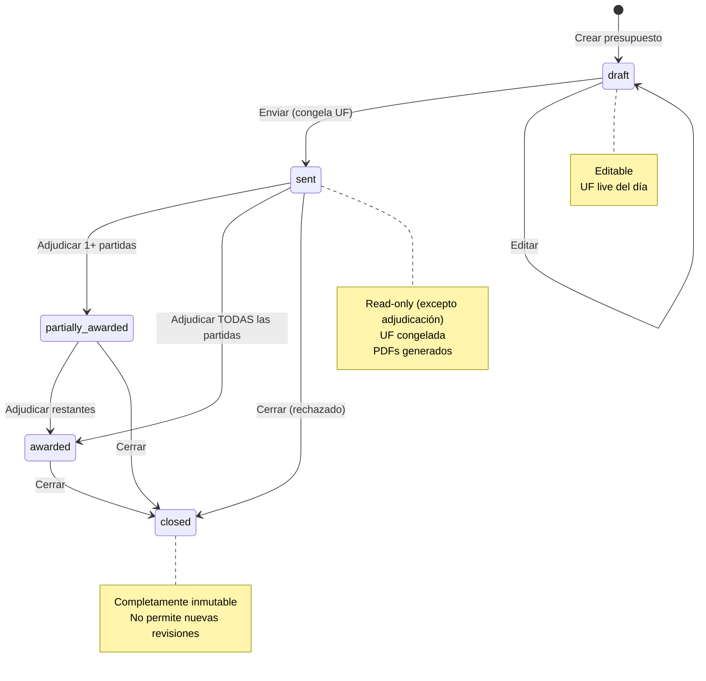

# 📚 VINISE Budget System — Base de Conocimiento del Proyecto

---

## 1. Glosario de Términos del Dominio

| Término | Definición | Contexto |
|---|---|---|
| **Empalme** | Conexión eléctrica entre la red de distribución y la instalación interior del cliente. Es el servicio principal que VINISE construye. | Tipos: monofásico (1 fase), trifásico (3 fases), subterráneo, aéreo, concentrado. |
| **Mandante** | Empresa distribuidora eléctrica que encarga los trabajos (Chilquinta, CGE, ENEL). | Cada mandante tiene su propio listado de precios y especificaciones. |
| **Partida** | Agrupación lógica de ítems dentro de un presupuesto. Ej: "Construcción Empalmes", "Obras Eléctricas", "Obras Civiles". | El Excel actual está limitado a 6 partidas; el sistema permite ilimitadas. |
| **Ítem** | Unidad de servicio o material con precio fijo en la base de datos. Ej: "Empalme monofásico subterráneo". | Cada ítem tiene un código único, valor de material (CLP) y valor de HH (CLP). |
| **Apellido** | Personalización de la descripción del ítem según el proyecto. Ej: "S-9/40A", "SR-225", "concentrado". | Se guarda como `custom_description` en cada línea del presupuesto. |
| **HH (Horas Hombre)** | Costo de mano de obra expresado en CLP por unidad de servicio. | Valor fijo calculado a partir de la planilla de costos de mano de obra de VINISE. |
| **UF (Unidad de Fomento)** | Unidad monetaria chilena reajustable según inflación. Se utiliza para expresar valores en presupuestos eléctricos. | Valor fluctuante diario. Al 03/03/2026 ≈ $38.400 CLP. Fuente oficial: CMF Chile. |
| **CLP (Peso Chileno)** | Moneda local de Chile. | Formato chileno: 1.234.567 (puntos como separador de miles). |
| **IVA** | Impuesto al Valor Agregado. Tasa fija: **19%** en Chile. | Se aplica sobre el valor neto para obtener el total con IVA. |
| **Prorrateo** | Distribución equitativa de un gasto general entre todas las partidas cuando el gasto tiene asignación "A" (All). | Fórmula: total_gasto_A / cantidad_partidas. |
| **Margen (Utilidad)** | Porcentaje que VINISE agrega sobre el costo base (material + HH) como ganancia. | Jerarquía: línea → partida → global. Rango: 0% – 100%. |
| **OOEE** | Obras Eléctricas. Tipo de partida. | Incluye canalizaciones, tableros, protecciones, etc. |
| **OOCC** | Obras Civiles. Tipo de partida. | Incluye excavaciones, hormigón, cámaras, ductos. |
| **CU** | "Cada Unidad". Unidad de medida más común para ítems. | Otros: M (metro), GL (global), ML (metro lineal), M² (metro cuadrado). |
| **REV** | Revisión del presupuesto. Se incrementa cuando se modifica un presupuesto enviado. | Formato: REV.00 (original), REV.01 (primera revisión), etc. |
| **CMF** | Comisión para el Mercado Financiero de Chile. | Entidad que provee la API oficial del valor UF. |
| **Snapshot** | Copia inmutable de valores al momento de agregar un ítem al presupuesto. | Si el precio base cambia después, el presupuesto mantiene el valor original. |
| **Adjudicación** | Cuando el mandante acepta y asigna el trabajo a VINISE. | Puede ser parcial: solo algunas partidas del presupuesto son adjudicadas. |

---

## 2. Reglas de Negocio con Ejemplos Numéricos

### 2.1 Cálculo de Valor Unitario UF

**Fórmula:**
```
valor_unitario_uf = (material_clp + hh_clp) × (1 + margin) / uf_value
```

**Ejemplo concreto:**
```
Ítem: Empalme monofásico subterráneo (Chilquinta)
  material_clp = $25.000
  hh_clp       = $15.000
  margin       = 20% (0,20)
  UF del día   = $38.426,21

Cálculo:
  costo_base = 25.000 + 15.000 = $40.000 CLP
  con_margen = 40.000 × (1 + 0,20) = 40.000 × 1,20 = $48.000 CLP
  valor_UF   = 48.000 / 38.426,21 = 1,2490... UF
  redondeado = Math.ceil(1,2490 × 100) / 100 = 1,25 UF  ← siempre hacia arriba
```

### 2.2 Cálculo de Valor Total por Línea

**Fórmula:**
```
valor_total_uf = valor_unitario_uf × cantidad
```

**Ejemplo:**
```
  valor_unitario = 1,25 UF
  cantidad       = 190 unidades

  valor_total    = 1,25 × 190 = 237,50 UF Neto
  con_IVA        = 237,50 × 1,19 = 282,63 UF+IVA (redondeado ↑)
```

### 2.3 Jerarquía de Márgenes

La jerarquía determina qué margen aplica a cada línea de ítem:

```
                    ┌─────────────────┐
                    │  Margen Global   │ ← Ej: 20% (aplica si no hay override)
                    │  (budget.global_ │
                    │   margin = 0.20) │
                    └────────┬────────┘
                             │ cascade ↓
                    ┌────────┴────────┐
                    │ Margen Línea     │ ← Ej: 30% (override específico)
                    │ (budget_lines.   │
                    │  line_margin)    │
                    └─────────────────┘
```

**Regla:** Si `line_margin` es NULL → usa `global_margin`. Si `line_margin` tiene valor → usa ese valor.

**Ejemplo:**
```
Presupuesto EECC-05:
  global_margin = 0,20 (20%)

  Partida 1:
    Línea A: line_margin = NULL  → usa 20% (global)
    Línea B: line_margin = 0,30  → usa 30% (override)
    Línea C: line_margin = NULL  → usa 20% (global)
```

### 2.4 Prorrateo de Gastos Generales

**Tipo "A" (All):** Se divide equitativamente entre todas las partidas.  
**Tipo "N" (Número):** Se asigna íntegramente a la partida N.

**Ejemplo completo:**
```
Presupuesto con 3 partidas:
  Partida 1: Total ítems = 500,00 UF
  Partida 2: Total ítems = 300,00 UF
  Partida 3: Total ítems = 200,00 UF

Gastos Generales:
  ┌────────────────┬───────────┬──────┬─────────────┬──────────────┐
  │ Nombre         │ Valor CLP │ Cant │ Total CLP   │ Asignación   │
  ├────────────────┼───────────┼──────┼─────────────┼──────────────┤
  │ Viáticos       │   50.000  │  10  │   500.000   │ A (General)  │
  │ Combustible    │   30.000  │  20  │   600.000   │ A (General)  │
  │ Arriendo grúa  │  800.000  │   1  │   800.000   │ 2 (Partida 2)│
  │ Bono viaje     │  100.000  │   4  │   400.000   │ A (General)  │
  └────────────────┴───────────┴──────┴─────────────┴──────────────┘

UF del día = $38.426,21

Cálculo de prorrateo "A":
  Total GA tipo "A" = 500.000 + 600.000 + 400.000 = $1.500.000 CLP
  En UF = 1.500.000 / 38.426,21 = 39,04 UF
  Por partida = 39,04 / 3 = 13,02 UF (redondeado ↑)

Gasto específico Partida 2:
  Arriendo grúa = 800.000 / 38.426,21 = 20,82 UF

  ┌───────────┬──────────┬──────────┬──────────┬──────────┐
  │ Partida   │ Ítems    │ GA Prorr │ GA Espec │ TOTAL    │
  ├───────────┼──────────┼──────────┼──────────┼──────────┤
  │ Partida 1 │ 500,00   │ 13,02    │   0,00   │ 513,02   │
  │ Partida 2 │ 300,00   │ 13,02    │  20,82   │ 333,84   │
  │ Partida 3 │ 200,00   │ 13,02    │   0,00   │ 213,02   │
  ├───────────┼──────────┼──────────┼──────────┼──────────┤
  │ TOTAL     │ 1.000,00 │ 39,06    │  20,82   │ 1.059,88 │
  └───────────┴──────────┴──────────┴──────────┴──────────┘
```

### 2.5 Congelamiento de UF al Enviar

```
Estado: draft → sent

ANTES del envío:
  budget.uf_value_at_creation = 38.000,00
  budget.uf_value_at_send = NULL
  Todos los valores se calculan con UF live

AL ENVIAR:
  UF del momento = 38.426,21
  budget.uf_value_at_send = 38.426,21  ← INMUTABLE
  budget.sent_at = '2026-03-03 23:55:00-03'
  Todos los valores se recalculan con esta UF congelada

DESPUÉS del envío:
  El presupuesto SIEMPRE muestra UF = 38.426,21
  Aunque la UF real suba a 39.000, el presupuesto no cambia
```

### 2.6 Snapshot Pattern (Inmutabilidad de Valores)

```
Momento T1: Admin actualiza ítem en base de datos
  items.material_value_clp = 25.000 → 30.000

Presupuesto EECC-05 (creado en T0):
  budget_lines.material_value_clp = 25.000  ← NO cambia
  (Porque es un snapshot del momento en que se agregó el ítem)

Presupuesto EECC-06 (creado en T2):
  budget_lines.material_value_clp = 30.000  ← Toma el nuevo valor
  (Porque se copia el valor actual al momento de agregar)
```

---

## 3. Diagrama de Estados del Presupuesto



**Tabla de transiciones:**

| Estado Actual | Acción | Estado Nuevo | Efectos |
|---|---|---|---|
| `draft` | Editar contenido | `draft` | Auto-save, audit log |
| `draft` | Enviar | `sent` | Congelar UF, generar PDFs, read-only |
| `sent` | Adjudicar 1 partida (de varias) | `partially_awarded` | Marcar partida, audit log |
| `sent` | Adjudicar TODAS las partidas | `awarded` | Marcar todas, audit log |
| `partially_awarded` | Adjudicar restantes | `awarded` | Cambio automático |
| `sent` / `partially_awarded` / `awarded` | Cerrar | `closed` | Completamente inmutable |
| Cualquiera (excepto `closed`) | Nueva Revisión | `draft` (nueva rev.) | Copia con REV+1, opción UF |

---

## 4. Flujo de Datos: Selección de Ítem → Generación de PDF

```
┌─────────────┐     ┌──────────────┐     ┌──────────────┐     ┌──────────────┐
│ 1. BÚSQUEDA │────▶│ 2. SELECCIÓN │────▶│ 3. SNAPSHOT  │────▶│ 4. EDICIÓN   │
│             │     │              │     │              │     │              │
│ Cmd+K abre  │     │ Editor elige │     │ material_clp │     │ Cantidad: 190│
│ Command     │     │ ítem de la   │     │ hh_clp       │     │ Descripción: │
│ Palette     │     │ lista        │     │ se copian al │     │ "...S-9/40A" │
│             │     │              │     │ budget_line   │     │ Margen: 20%  │
└─────────────┘     └──────────────┘     └──────────────┘     └──────┬───────┘
                                                                     │
                                                                     ▼
┌─────────────┐     ┌──────────────┐     ┌──────────────┐     ┌──────────────┐
│ 8. PDF      │◀────│ 7. STORAGE   │◀────│ 6. RENDER    │◀────│ 5. CÁLCULO   │
│             │     │              │     │              │     │              │
│ Usuario     │     │ PDF se sube  │     │ react-pdf    │     │ UF del día   │
│ descarga    │     │ a Supabase   │     │ server-side  │     │ (material+HH)│
│ con URL     │     │ Storage      │     │ rendering    │     │ × (1+margin) │
│ firmada     │     │              │     │              │     │ / UF = valor  │
└─────────────┘     └──────────────┘     └──────────────┘     └──────────────┘
```

**Detalle por etapa:**

1. **Búsqueda:** El editor presiona Cmd+K → se abre `ItemSearchDialog` → consulta Server Action `searchItems` → Supabase query con full-text search en `items.code` e `items.description`

2. **Selección:** El editor selecciona un ítem de los resultados filtrados por compañía y tipo de partida

3. **Snapshot:** Server Action `addBudgetLine` copia `material_value_clp` y `hh_value_clp` del ítem al `budget_line` → estos valores NUNCA cambian después

4. **Edición:** Editor personaliza `custom_description` (apellido), ingresa `quantity`, opcionalmente ajusta `line_margin`

5. **Cálculo:** Client-side calcula en tiempo real:
   - `unit_uf = (material + hh) × (1 + margin) / uf_value`
   - `total_uf = unit_uf × quantity`
   - `total_uf_iva = total_uf × 1.19`
   - Todos los redondeos con `Math.ceil(x * 100) / 100`

6. **Render:** Server Action `generatePDF` usa react-pdf para renderizar el documento con datos del presupuesto completo

7. **Storage:** El PDF renderizado se sube a Supabase Storage bajo la ruta `budgets/{budget_id}/VINISE_EECC-XX_REVXX_{tipo}.pdf`

8. **Descarga:** Se genera signed URL con TTL de 1 hora para descarga segura

---

## 5. Guía de Onboarding para Nuevos Usuarios

### 5.1 Primeros Pasos

#### Paso 1: Acceder al Sistema
1. Recibirás un email de invitación con un enlace
2. Haz clic en el enlace para activar tu cuenta
3. Desde ahora, para ingresar: ve a la página de login e ingresa tu email
4. Recibirás un "enlace mágico" por email — haz clic para entrar (no necesitas contraseña)

#### Paso 2: Tu Dashboard
Al ingresar verás tu dashboard con:
- **Lista de presupuestos** recientes con su estado (Borrador, Enviado, Adjudicado, Cerrado)
- **Barra de navegación** lateral con accesos a: Presupuestos, Base de Datos, Clientes, Configuración

#### Paso 3: Tu Primer Presupuesto
1. Haz clic en **"Nuevo Presupuesto"**
2. Selecciona o crea el **cliente** (empresa, contacto, ciudad)
3. El sistema asigna automáticamente un código (ej: EECC-07 REV.00)
4. Agrega una **partida** (ej: "Construcción Empalmes Monofásicos")
5. Presiona **Cmd+K** (o "Agregar Ítem") para buscar ítems
6. Selecciona el ítem deseado → ingresa la **cantidad**
7. Repite para todas las partidas necesarias
8. Revisa el **Cuadro Resumen** al final de la página
9. Haz clic en **"Preview"** para ver la carta antes de enviar

### 5.2 Conceptos Clave para Usuarios

#### ¿Qué es la UF?
La Unidad de Fomento es una moneda de referencia en Chile que se ajusta diariamente según la inflación. El sistema la obtiene automáticamente. Cuando envías un presupuesto, el valor de UF de ese día se "congela" para que no cambie después.

#### ¿Qué es el margen?
Es el porcentaje de ganancia que VINISE cobra sobre el costo base. Puedes configurar un margen global (ej: 20% para todo el presupuesto) y luego ajustar ítems específicos si necesitan un margen diferente.

#### ¿Qué son los Gastos Generales?
Son costos adicionales del proyecto (viáticos, combustible, arriendo de equipos) que se agregan al presupuesto. Puedes asignarlos a:
- **"A" (General):** Se reparten equitativamente entre TODAS las partidas
- **Número (ej: "2"):** Se cargan solo a esa partida específica

#### ¿Qué pasa cuando envío el presupuesto?
1. El valor de UF del día se congela (ya no cambia)
2. Se generan automáticamente 2 PDFs (carta general y desglosada)
3. El presupuesto se vuelve de solo lectura
4. Puedes descargar los PDFs para enviarlos al cliente

#### ¿Puedo modificar un presupuesto enviado?
No directamente. Debes crear una **"Nueva Revisión"** que será una copia editable. El sistema te preguntará si quieres actualizar la UF al valor de hoy o mantener la original.

### 5.3 Atajos de Teclado

| Atajo | Acción |
|---|---|
| `Cmd+K` | Abrir búsqueda de ítems |
| `Cmd+S` | Guardar cambios |
| `Cmd+P` | Preview de carta |
| `Cmd+D` | Duplicar línea seleccionada |
| `Enter` | Confirmar edición de celda |
| `Tab` | Siguiente campo editable |
| `Escape` | Cancelar edición actual |

---

## 6. FAQ Técnico para el Equipo de Desarrollo

### Arquitectura

**P: ¿Por qué Server Components por defecto?**  
R: Seguridad y rendimiento. Los Server Components ejecutan en el servidor, nunca exponen secrets al cliente, y reducen el bundle de JavaScript enviado al browser. Solo usamos Client Components ('use client') cuando hay interactividad (formularios, realtime, drag-and-drop).

**P: ¿Por qué Server Actions en vez de API Routes?**  
R: Server Actions ofrecen type-safety end-to-end con TypeScript, manejan automáticamente la serialización, y son la recomendación oficial de Next.js 15 para mutaciones. Además, nunca exponen endpoints públicos.

**P: ¿Cuándo usar TanStack Query vs Server Components?**  
R: Server Components para datos iniciales que no cambian frecuentemente (lista de presupuestos al cargar página). TanStack Query para datos que necesitan refetch (valor UF, cambios realtime) o para optimistic updates.

### Base de Datos

**P: ¿Por qué snapshot en vez de reference al editar budget_lines?**  
R: Si los precios de la base de datos cambian después de crear un presupuesto, el presupuesto original no debe verse afectado. Un presupuesto enviado con ciertos precios es un documento legal. El snapshot garantiza inmutabilidad.

**P: ¿Cómo funciona RLS para este sistema?**  
R: Todas las políticas RLS verifican que el usuario tenga una sesión válida de Supabase Auth. Admin puede hacer CRUD en todas las tablas. Editor puede CRUD en budgets/lines/partitions/clients pero solo SELECT en items. Audit_log es INSERT-only para todos los roles.

**P: ¿Cómo se maneja la concurrencia?**  
R: Last-write-wins con Supabase Realtime. Con 5-7 usuarios y política de editar diferentes partidas, los conflictos son raros. Toast notifications avisan cuando alguien más modifica un campo. Para MVP esto es suficiente; para escalado futuro considerar CRDTs o Liveblocks.

### UF y Cálculos

**P: ¿Qué pasa si la API de CMF está caída?**  
R: Tenemos tabla `uf_cache` en Supabase con TTL de 1 hora. Si la API falla, usamos el último valor cacheado y mostramos banner de advertencia "UF obtenida de caché — última actualización: [fecha]". El sistema NUNCA debe fallar por la API de UF.

**P: ¿Por qué Math.ceil en vez de Math.round?**  
R: Convención del sector eléctrico chileno. Los presupuestos siempre redondean hacia arriba para proteger el margen. `Math.ceil(1.2490 * 100) / 100 = 1.25 UF` (no 1.24 UF).

**P: ¿Dónde se ejecutan los cálculos?**  
R: Los cálculos de visualización (valor unitario, totales) se ejecutan en el cliente para UX instantánea. Los cálculos de validación se re-ejecutan en el servidor (Server Action) antes de guardar. Ambos usan la misma función `calculateLineValue()` exportada desde `lib/calculations.ts`.

### PDFs

**P: ¿Por qué react-pdf y no html2pdf/puppeteer?**  
R: react-pdf genera PDFs de forma nativa sin necesidad de un browser headless (puppeteer requiere Chromium, prohibitivo en serverless). Además, permite usar componentes React para definir el layout del PDF.

**P: ¿Dónde se almacenan los PDFs?**  
R: En Supabase Storage bajo el bucket `budget-pdfs` con la estructura: `{budget_id}/VINISE_{code}_{revision}_{tipo}.pdf`. Las URLs de descarga son signed URLs que expiran en 1 hora.

### Deployment

**P: ¿Cuáles son las variables de entorno necesarias?**  
R:
```
NEXT_PUBLIC_SUPABASE_URL=https://xxx.supabase.co
NEXT_PUBLIC_SUPABASE_ANON_KEY=eyJ...
SUPABASE_SERVICE_ROLE_KEY=eyJ...        # Solo server-side
CMF_API_KEY=xxx                          # Solo server-side
```
`NEXT_PUBLIC_` prefix = disponible en cliente. Sin prefix = solo servidor.

**P: ¿Cómo actualizo el esquema de base de datos en producción?**  
R: Crear un archivo `.sql` de migración en `supabase/migrations/`, testear localmente con `supabase db push`, y luego aplicar en producción desde el dashboard de Supabase o via CLI `supabase db push --linked`.
